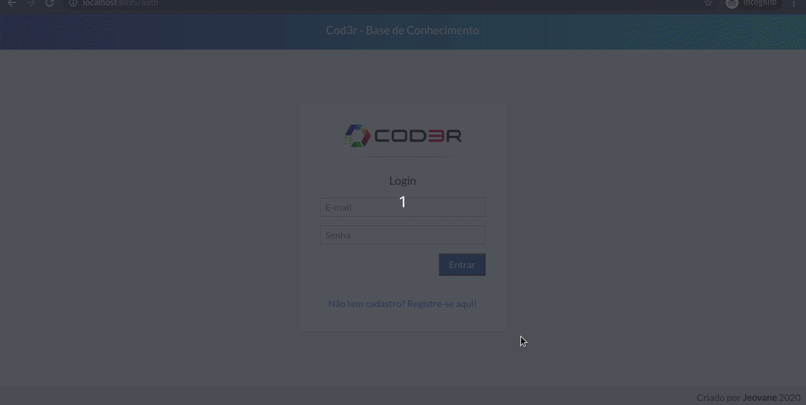
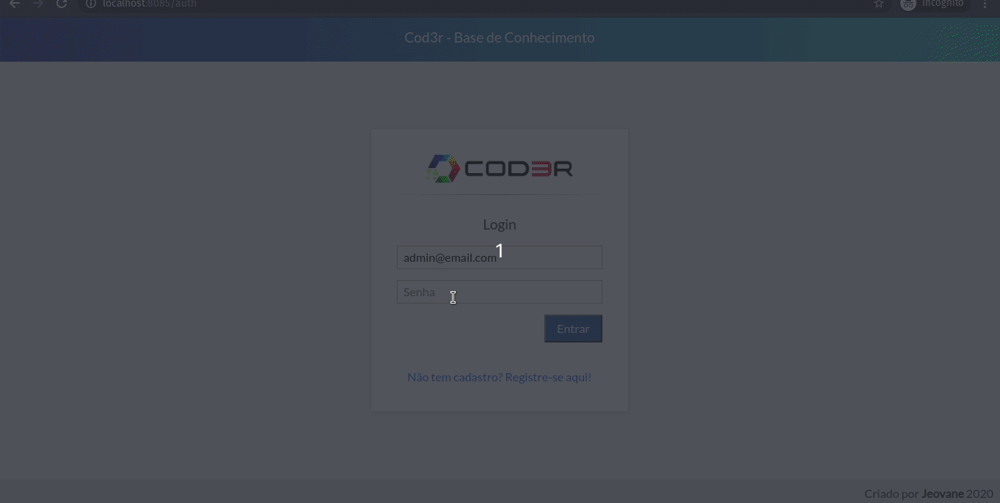
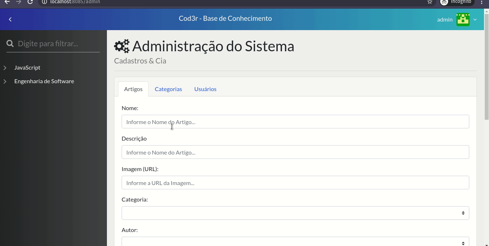

<h1 align="center">Knowledge</h1>

<h2 align="center">Crie, edite e visualize artigos e documentos de maneira simples</h2>

<p align="center">
    <a href="https://nodejs.org/en/">
        
    </a>
</p>

<p align="center">
    <a href="https://vuejs.org/">
        
    </a>
</p>


## Sumário

- [:books: Sobre](#books-sobre)
- [:robot: Técnologias](#robot-técnologias)
- [:question: Como executar](#question-como-executar)
- [:computer: Visão Geral](#computer-visão-geral)

<a id="sobre"></a>
## :books: Sobre

O Knowledge é um gerenciador de artigos e documentos, com ele é possível adicionar artigos e editar artigos. É um gerenciador muito fácil de usar, isso devido a sua organização.

<a id="tecnologias"></a>
## :robot: Técnologias

As principais técnologias utilizadas foram:

- [Node.js](https://nodejs.org/en/)
- [VueJS](https://vuejs.org/)

## :question: Como executar

- #### **Requisitos**
    - Ter o [Node.js](https://nodejs.org/en/)
    - Ter um gerenciador de pacotes [NPM](https://www.npmjs.com/) ou [Yarn](https://yarnpkg.com/)
    - Ter o [Knex](http://knexjs.org/) (instalar de forma global)
    - Ter o [PostgreSQL](https://www.postgresql.org/)
    - Ter o [MongoDB](https://www.mongodb.com/)
    - Configure o arquivo env_file dentro da pasta backend, adicone suas informações e altere o nome do arquivo para .env

- #### Faça um clone
```sh
  $ git clone https://github.com/jeovane16/knowledge.git
```

- #### Execute os comandos (de preferência na ordem mostrada) 

```sh
  # Crie o banco de dados após entrar no postgres

  $ CREATE DATABASE knowledge;

  # Instale as dependências do package.json
  $ npm install

  # Crie as migrations e execute o backend
  $ cd backend
  $ npm start

  # Inicie a aplicação frontend
  $ cd frontend
  $ npm run serve -- --port 8080

```

<a id="visao-geral"></a>
## :computer: Visão Geral

<h1 align="center">
    
</h1>

<h1 align="center">
    
</h1>

<h1 align="center">
    
</h1>

<h1 align="center">
    
</h1>
